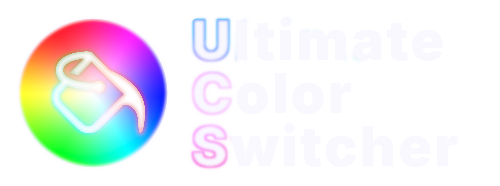
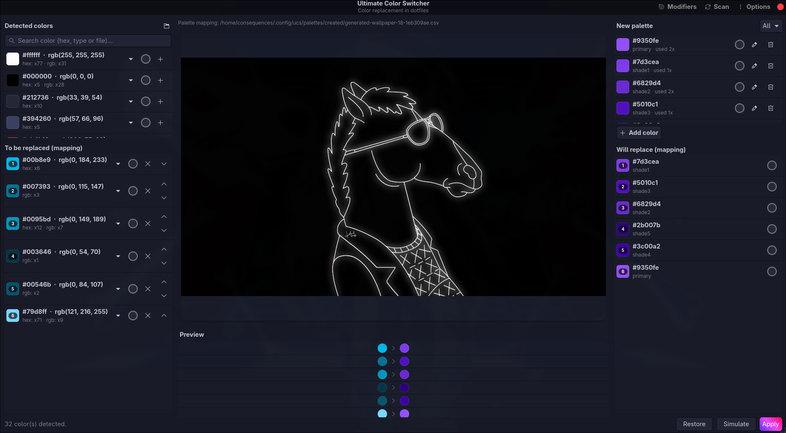

<div align="center">




Detectá los colores usados en tus dotfiles, armá una paleta nueva —a mano o generada automáticamente desde un wallpaper— y aplicá el reemplazo de forma segura, con backup y un modo de simulación antes de tocar nada de verdad.

</div>

<table>
<tr>
<td width="50%" valign="top">

### 🎨 Paleta automática
Genera una paleta directo desde tu wallpaper (K-Means + espacio Lab/ΔE hechos a mano): 3 modos de selección, ponderación de scoring configurable, paleta complementaria (Ying Yang), variantes con shuffle/overfetch y ajuste de saturación.

</td>
<td width="50%" valign="top">

### 🖥️ GUI + CLI
Mismo backend, dos formas de usarlo: una ventana GTK4/libadwaita para uso interactivo, o una CLI completa para scripts y hooks.

</td>
</tr>
<tr>
<td width="50%" valign="top">

### 🛡️ Seguro por defecto
Backup automático de cada archivo antes de tocarlo, modo simulación (`test`/`--test`) y detección de conflictos antes de aplicar nada.

</td>
<td width="50%" valign="top">

### 🔗 Automatizable
Un solo comando (`ucs automatic --from-image`) para regenerar todo el tema — ideal como hook al cambiar de wallpaper.

</td>
</tr>
</table>

## Contenidos

- [Instalación](#instalación)
- [Configuración inicial](#configuración-inicial)
- [Uso — GUI](#uso--gui)
- [Uso — CLI, paso a paso](#uso--cli-paso-a-paso)
- [Referencia rápida de comandos](#referencia-rápida-de-comandos)
- [Desarrollo](#desarrollo)

## Instalación

### Arch Linux (AUR)

```bash
paru -S ucs-git   # o yay, o makepkg -si desde packaging/PKGBUILD
```

Esto instala el comando `ucs`, su entrada de menú (`.desktop` + ícono) y resuelve automáticamente las dependencias del sistema (GTK4, libadwaita, PyGObject, numpy, Pillow).

<details>
<summary><b>Manual / otras distros</b> (no todo el mundo usa Arch)</summary>

<br>

También anda como paquete Python normal. GTK4, libadwaita y PyGObject son librerías del sistema — **no** vienen con pip, hay que instalarlas primero con el gestor de paquetes de tu distro:

```bash
# Arch
sudo pacman -S python-gobject gtk4 libadwaita blueprint-compiler

# Debian/Ubuntu
sudo apt install python3-gi gir1.2-gtk-4.0 gir1.2-adw-1 blueprint-compiler

# Fedora
sudo dnf install python3-gobject gtk4 libadwaita blueprint-compiler
```

La mayoría de las distros (Debian/Ubuntu/Fedora incluidas) bloquean `pip install` a nivel global o de usuario para proteger el gestor de paquetes del sistema (PEP 668, "externally-managed-environment"). La forma correcta es un entorno virtual — pero uno con `--system-site-packages`, para que herede el PyGObject/GTK4/libadwaita que ya instalaste con el gestor de paquetes en vez de intentar reconstruirlos desde pip (lo cual no funciona sin los headers de desarrollo del sistema):

```bash
git clone https://github.com/GG2R10/ultimate-color-switcher.git
cd ultimate-color-switcher

# compilar las interfaces GTK una vez (si no tenés blueprint-compiler, se
# compilan solas la primera vez que corrés la GUI, no hace falta este paso)
for blp in color_switcher/gui/blueprints/*.blp; do
    blueprint-compiler compile "$blp" --output "${blp%.blp}.ui"
done

python -m venv --system-site-packages ~/.local/share/ucs-venv
~/.local/share/ucs-venv/bin/pip install .          # o "pip install -e ." para desarrollo
ln -s ~/.local/share/ucs-venv/bin/ucs ~/.local/bin/ucs
```

Alternativa si usás [pipx](https://pipx.pypa.io/): `pipx install --system-site-packages .` hace lo mismo en un paso, sin el `ln -s` manual.

Asegurate de que `~/.local/bin` esté en tu `PATH`.

</details>

## Configuración inicial

Los datos de usuario (config, paletas, mappings) viven en `~/.config/ucs/`, separados del código — se crean solos la primera vez que corrés `ucs`. El archivo central es `~/.config/ucs/config.json`:

```json
{
  "files_to_replace": [
    "$HOME/.config/hypr/hyprlock.conf",
    "$HOME/.config/waybar/colors.css"
  ],
  "backup_dir": "$HOME/.config-colors-backup"
}
```

- `files_to_replace`: los archivos de configuración donde se buscan y reemplazan colores. Se pueden gestionar sin editar el JSON a mano — ver [`ucs config files`](#uso--cli-paso-a-paso) o el menú **Archivos a escanear…** de la GUI. Si está vacío (primera vez), después de la bienvenida la GUI te ofrece **buscar automáticamente en `~/.config`** los archivos que tengan colores (con un árbol para revisar y descartar carpetas/archivos antes de confirmar), agregarlos a mano o editar `config.json`. Lo mismo desde la CLI con [`ucs config files scan-config`](#1-elegir-qué-archivos-escanear).
- `backup_dir`: dónde se guarda una copia de cada archivo antes de tocarlo de verdad.

Las rutas admiten `$HOME`/`~` y se guardan así (no absolutas), para que `config.json` siga siendo válido entre máquinas que comparten estos dotfiles.

## Uso — GUI

```bash
ucs            # o: ucs gui
```

<div align="center">

</div>

<!--
TODO (pendiente de assets): agregar acá los dos GIFs de demo una vez estén listos —
  1. assets/demo_gui.gif      -- uso general de la GUI (armar un mapping y aplicar)
  2. assets/demo_automatic.gif -- `ucs automatic --from-image` corriendo al cambiar de wallpaper
-->

La ventana principal tiene dos columnas: colores detectados (izquierda) y la paleta nueva (derecha). Seleccionás un color detectado, le asignás un color de la paleta, y así armás el mapping. El menú (⋮) tiene:

- **Nueva paleta… / Importar paleta… / Agregar color…** — gestión de la paleta objetivo.
- **Generar paleta desde imagen…** — arma una paleta automáticamente a partir de un wallpaper.
- **Configurar generación de paleta…** — modo de selección (contraste / balanceado / shading), saturación extra (`--my-eyes`), **Ying Yang** (paleta complementaria), ponderación de scoring (default / alternativo / custom), comparación de contraste (ponderado vs solo background) y opciones avanzadas (overfetch y shuffle para explorar variantes).
- **Vincular hex/rgb automáticamente** — un mismo color que aparece en dos formatos distintos en tus archivos se trata como uno solo por defecto.
- **Archivos a escanear…** — agregar/quitar archivos de `files_to_replace` (incluye la búsqueda automática en `~/.config`).
- **Servicios a reiniciar…** — comandos a correr después de un apply real (ej. reiniciar waybar).
- **Guardar snapshot de detección…** — guarda una copia con nombre de la detección actual, para volver a usarla después.

Los botones **Simular** y **Aplicar** hacen lo mismo que `test`/`apply` en la CLI.

## Uso — CLI, paso a paso

Todos los comandos son no-interactivos salvo `mapping new` (que es una sesión guiada) y `restore` (que pregunta si reiniciar servicios, salvo que uses `--restart`/`--no-restart`).

### 1. Elegir qué archivos escanear

```bash
ucs config files list
ucs config files add ~/.config/waybar/colors.css
ucs config files remove '$HOME/.config/waybar/colors.css'

# o dejá que busque solo en ~/.config los archivos con colores:
ucs config files scan-config --dry-run   # previsualizar sin agregar
ucs config files scan-config             # buscar + confirmar + agregar
```

`scan-config` recorre `~/.config` filtrando por formato (`.conf`, `.toml`, `.css`, `.rasi`, `.lua`, … y archivos llamados `config`), salta binarios, archivos grandes y directorios de cache/logs/`.git`/`node_modules`, y no sigue symlinks de directorio. Es una base para empezar: puede incluir hex que no son colores (ej. `0xADDR`) o archivos que no querés tocar — revisalos y quitá lo que sobre con `ucs config files remove`.

### 2. Detectar los colores actuales

```bash
ucs detect
```

Escanea `files_to_replace`, guarda el resultado en `~/.config/ucs/palettes/detected/detected_palette.csv` y te muestra cada color detectado con un `id` — ese `id` es lo que vas a usar para armar el mapping.

### 3. Conseguir una paleta objetivo

Opción A — a mano:

```bash
ucs palette create mi-tema.csv --add ff00aa primary --add 00ccff secondary
```

Opción B — generada automáticamente desde un wallpaper:

```bash
ucs palette generate ~/wallpapers/actual.jpg --colors 4 --mode contrast
ucs palette show palettes/created/generated.csv   # verla en la terminal con swatches
```

Opciones de `palette generate` (todas también disponibles en `automatic --from-image`):

| Opción | Qué hace |
|---|---|
| `--mode contrast\|balanced\|shading` | `contrast` (default): el secondary contrasta con el primary. `balanced`: el secondary se elige por calidad general, sin ese sesgo (suele parecerse más al primary). `shading`: el resto de la paleta son variantes de luminosidad del primary. |
| `--my-eyes` | Satura un poco más los colores elegidos. |
| `--ying-yang on\|off` | Ying Yang (default `off`): usa la paleta complementaria (rota todos los tonos 180°). |
| `--scoring default\|alternative\|custom` | Cómo se pondera coverage / saturación / midtone / contraste al elegir colores. `custom` usa `--custom-scoring-values coverage=20,saturation=40,midtone=30,contrast=10` (deben sumar 100), o lo guardado en `config.json`. |
| `--no-weighted-contrast` | Compara el contraste solo contra el color más dominante, en vez del sistema ponderado contra todos los clusters (default: ponderado). |
| `--shuffle N\|next` | Saltea los primeros N candidatos a primary (todo lo demás se reelige a partir de eso). `next` retoma desde el último valor + 1, cíclico — pensado para scripts que van probando variantes. |
| `--overfetch N` | Considera N candidatos extra más allá de `--colors`, para darle más margen a `--shuffle`. |

Sin `--out`, se guarda siempre en el mismo archivo (`palettes/created/generated.csv`, se reemplaza cada vez). `ucs palette show <paleta>` imprime cualquier paleta con sus colores en la terminal.

### 4. Armar el mapping (qué color detectado va a qué color de la paleta)

```bash
ucs mapping new mi-tema.csv
```

Es una sesión interactiva: te muestra los colores detectados y la paleta, y vas ingresando pares `<id detectado> <id de la paleta>`. Se guarda en `mappings/mapping.csv` (el mapping "canónico" — siempre el mismo archivo, se recarga solo la próxima vez que abrís la GUI o volvés a correr `detect`).

### 5. Probar antes de aplicar

```bash
ucs test --mapping mappings/mapping.csv
```

No modifica nada, solo te dice cuántos reemplazos haría.

### 6. Aplicar de verdad

```bash
ucs apply --mapping mappings/mapping.csv
```

Hace backup de cada archivo afectado (a `backup_dir`) antes de modificarlo, y corre los "servicios a reiniciar" que tengas habilitados.

### 7. Deshacer

```bash
ucs restore
```

Restaura los archivos desde el backup. `--restart`/`--no-restart` evitan la pregunta sobre reiniciar servicios.

### 8. Modo automático (todo en un paso)

Una vez que ya tenés un mapping armado (paso 4), podés reaplicarlo con una paleta distinta sin repetir todo el proceso — típicamente para regenerar el tema cada vez que cambiás de wallpaper (ver el hook de ejemplo más abajo):

```bash
ucs automatic --from-image ~/wallpapers/actual_wallpaper.jpg
```

`--from-image` genera la paleta en el momento (usando la configuración guardada, o cualquier opción de [`palette generate`](#3-conseguir-una-paleta-objetivo) explícita: `--colors`, `--mode`, `--my-eyes`, `--ying-yang`, `--scoring`, `--shuffle`, `--overfetch`…) y la aplica contra el mapping canónico. `--mapping` es opcional (default: el mapping canónico). También podés pasarle una paleta ya generada en vez de `--from-image`:

```bash
ucs automatic palettes/created/mi-tema.csv --mapping mappings/mapping.csv
```

Bloqueos y cómo saltarlos:

- **Paleta insuficiente** (menos colores que roles necesita el mapping): bloqueo duro, no se puede saltar — no hay de dónde sacar el color faltante.
- **Colores de más** (más colores que roles, los extra quedan sin usar): pide confirmación con `--yolo`.
- **Conflictos** (caso 1 / convergencia: un color chocaría con otro color detectado y se perdería la distinción): pide confirmación con `--force`.

`--force` y `--yolo` están separados a propósito: aceptar "sobran colores" no te cuela un conflicto real, y viceversa. `--test` simula sin aplicar.

**Ejemplo real**: hook para regenerar el tema automáticamente al cambiar de wallpaper (agregado al final del script que setea el wallpaper, en background para no agregar latencia):

```bash
ucs automatic --from-image "$WALLPAPER_FOLDER/actual_wallpaper.jpg" &
```

## Referencia rápida de comandos

<details open>
<summary>Ver tabla completa</summary>

<br>

| Comando | Qué hace |
|---|---|
| `detect [--dry-run]` | Escanea y actualiza `detected_palette.csv` |
| `config files list\|add\|remove` | Gestiona `files_to_replace` |
| `config files scan-config [--dry-run] [--yes]` | Busca en `~/.config` archivos con colores y los agrega |
| `palette create <ruta> --add HEX LABEL ...` | Crea una paleta a mano |
| `palette generate <imagen> [--colors N] [--mode ...] [--my-eyes] [--ying-yang on\|off] [--scoring ...] [--shuffle N\|next] [--overfetch N] [--no-weighted-contrast]` | Genera una paleta desde un wallpaper |
| `palette show [paleta]` | Muestra una paleta con sus colores en la terminal (sin paleta: la que aplica el mapping actual) |
| `palette list` | Lista las paletas creadas |
| `palette add-color [paleta] <hex> [--label LABEL]` | Agrega un color a una paleta existente (sin paleta: la que aplica el mapping actual) |
| `mapping new <paleta>` | Sesión interactiva para armar el mapping |
| `mapping show <mapping>` | Muestra un mapping y sus conflictos |
| `test [--mapping <mapping>]` | Simula un apply |
| `apply [--mapping <mapping>]` | Aplica de verdad (con backup) |
| `restore [--restart\|--no-restart]` | Deshace desde el backup |
| `automatic <paleta>\|--from-image  [--mapping <mapping>] [--force] [--yolo]` | Aplica una paleta (existente o generada) contra un mapping ya armado |
| `gui` | Lanza la interfaz gráfica (también: `ucs` sin argumentos) |

Corré `ucs <comando> --help` para ver todas las opciones de cada uno.

</details>

## Desarrollo

```bash
git clone https://github.com/GG2R10/ultimate-color-switcher.git
cd ultimate-color-switcher
python -m venv --system-site-packages .venv
.venv/bin/pip install -e '.[dev]'
.venv/bin/pytest
```

<details>
<summary><b>Estructura del proyecto</b></summary>

<br>

```
.
├── pyproject.toml
├── packaging/            # PKGBUILD + .desktop para el paquete de AUR
├── color_switcher/
│   ├── main.py             # CLI (incluye el subcomando `gui`; entry point de `ucs`)
│   ├── backend/             # lógica pura, sin dependencias de GTK — testeada con pytest
│   └── gui/                  # ventana principal, diálogos y blueprints (.blp) de GTK4/libadwaita
├── tests/
└── ROADMAP.md              # plan de migración original (bash → Python + GTK), como referencia histórica
```

`backend/` no depende de `gui/` en ningún sentido — toda la lógica (detección, reemplazo, mappings, generación de paletas) es invocable y testeable sin abrir ninguna ventana; `main.py` y `gui/` son dos frontends distintos sobre el mismo backend.

</details>

## Licencia

[GPL-2.0](LICENSE)
